# JEV Agentic Router (JAR)

[](https://github.com/AndresAlmozara/jar/actions/workflows/ci.yml)
[](LICENSE)
[](https://nodejs.org/)

JAR is a portable System-1 routing layer that helps coding agents see the right
working context before the main coding model acts. A host task enters through a
runtime adapter; JAR shapes a bounded model-visible surface; then the main model
does the coding work and chooses which tools to call. Host permissions and
JAR's deterministic identity, eligibility, policy, materialization, and
verification remain authoritative throughout.

JAR is not an autonomous coding agent, a tool executor, or a replacement for
the main model. **JAR V1 is the canonical product.** It routes skills and
repository evidence, observes fresh output with exact pass-through in Shadow,
and bounds capability exposure. TypeSafe/JEV semantic judgment is advisory and
used only inside deterministic constraints.

[](https://andresalmozara.github.io/jar/visuals/jar-v1.architecture.html)

[Explore interactive architecture](https://andresalmozara.github.io/jar/visuals/jar-v1.architecture.html) · [Download standalone HTML](docs/visuals/jar-v1.architecture.html) · [View typed source](docs/visuals/jar-v1.architecture.json)

[Static SVG](docs/visuals/assets/jar-v1.architecture-hero.svg) · [Provenance](docs/visuals/jar-v1.architecture.provenance.json)

## How to think about JAR

One routed turn follows a narrow path:

1. The coding host and runtime adapter observe the task and the sources the host
   makes available.
2. Deterministic JAR code establishes identity, inventory truth, eligibility,
   policy, and safe operating bounds.
3. M5, M6, and M8 bound the model-visible surface, while M7 observes exact
   pass-through fresh output in Shadow. Where JEV is used, it proposes
   relevance, ranking, or classification inside deterministic bounds; it never
   grants permission or proves inventory, materialization, or exposure.
4. The main coding model receives the prepared surface and performs the work
   through host-controlled tools. Receipts and passive telemetry observe the
   route without joining the authorization path.

## Canonical product

| Module | JAR V1 strategy |
| --- | --- |
| M5 skill routing | `skill/ecc-native-v1` |
| M6 repository context | `context/deterministic-v1` |
| M7 fresh output | exact-pass-through Shadow observation |
| M8 capability exposure | `capability/jev-hierarchical-cover-v1` |

The default treatment is always `v1`. Experimental treatments require an
explicit treatment ID and never become implicit through ordinary product use.

The component research program is paused. M6-r1 remains a validated but
non-promoted specialist treatment; its benefit was strongest under selection
pressure and was not robust across task regimes. See
[the research ledger](docs/RESEARCH.md).

## Daily driver

JAR V1 runs through a personal Codex plugin with lifecycle hooks and a
content-addressed local runtime. It does not copy JAR into target repositories
or execute from the mutable development checkout.

```powershell
npm run codex:plugin:install
jar status
jar doctor
```

Updates are explicit (`npm run codex:plugin:update`); uninstall removes only
JAR-owned material (`npm run codex:plugin:uninstall`). Runtime snapshots,
session state, receipts, and logs live under `~/.jar/` by default.

Always-on local metadata telemetry is a canonical daily-driver capability and
is enabled by default in the installed profile. It observes routing and
downstream activity without changing routing decisions or adding model calls.
Raw evidence remains local in the configured, Git-ignored `.jar/telemetry/`
store and can be stopped explicitly with `jar telemetry disable`. See the
[telemetry manual](docs/TELEMETRY.md).

M5 and M6 are fully materialized. M7 remains exact-pass-through Shadow. M8 is
causal only for an explicitly complete, identity-bound tool profile; unknown or
incomplete inventories remain observational and never become an implicit deny.

## Host roadmap

Codex is the only first-class daily-driver integration today. When host-adapter
work resumes, the intended order is **Claude Code → OpenCode → Pi**. OpenCode
already has limited observational adapter support in the repository; this
roadmap refers to bringing each host to a first-class daily-driver boundary,
not claiming current parity.

This is a direction, not a committed release schedule, and it remains deferred
during the current observation window.

## Documentation

- [Architecture](docs/ARCHITECTURE.md) — current product architecture.
- [Always-on telemetry](docs/TELEMETRY.md) — local observation, privacy, maintenance and operator commands.
- [Evolution](docs/EVOLUTION.md) — concise product and research journey.
- [Research](docs/RESEARCH.md) — canonical scientific memory and dispositions.
- [Status](docs/STATUS.md) — operational state and maintenance posture.
- [Decisions](docs/DECISIONS.md) — durable accepted decisions.

Detailed raw provenance, historical branches, telemetry evidence, and vendor
corpus snapshots remain in the private development archive and are not
distributed with this public package.

## Quick start

Requirements are Node.js 20 or newer. Ordinary tests and offline inspection do
not require credentials or network access.

```bash
npm test
npm run test:diagnostics
node bin/jar.js --help
node bin/jar.js catalog inspect --ecc-root fixtures/ecc-mini
node bin/jar.js skill shadow --task "Add regression tests" --ecc-root fixtures/ecc-mini --offline
node bin/jar.js context shadow --repo-root . --task "Find the routing contract"
node bin/jar.js capability shadow --task "Read source and run tests" --inventory fixture
```

Authentication and live operations are always explicit. Preparation is not
execution, and a routing proposal is not an applied effect.

## Evaluation model

The public `npm test` command runs the portable supported suite used by the
Ubuntu/Windows and Node 20/22 CI matrix. `npm run test:diagnostics` runs the
permanent zero-turn M6/M8 diagnostic regressions on Node 22. Live inference is
never part of ordinary validation.

- `evals/generational/` is the frozen common L0/L1/L2 evaluator.
- `evals/benchmark/` owns the SOFT/HARD product harnesses.
- `evals/smoke-test/` owns smoke and integration checks.
- `evals/component-diagnostics/` owns reusable M6/M8 mechanism diagnostics.
- `evals/component-diagnostics/m8-v2/` enforces shared pre-treatment pair identity.
- generated evidence lives under ignored `.jar/`, not canonical source control.
- Windows Sandbox tests, local-runtime forensic tests, private telemetry, and
  raw campaign outputs remain in the private development archive; they are not
  represented as cross-platform public support.

Zero-turn checks include:

```bash
node evals/benchmark/scenario-run.mjs --benchmark opsdesk-soft-v1 --preflight-only
node evals/benchmark/scenario-run.mjs --benchmark opsdesk-hard-v2.4 --preflight-only
node evals/generational/run.mjs --self-test
npm run test:diagnostics
```

## Safety posture

- JEV proposes; deterministic facts, policy, and verifiers decide.
- Unknown is distinct from false, empty, unavailable, denied, and unsupported.
- Provider failure cannot bypass the independently policy-eligible set.
- Credentials and raw provider payloads do not belong in ordinary receipts.
- CONTROL and JAR conditions must share a compatible observed runtime boundary.
- fresh-output reduction remains Shadow-only; exact pass-through is canonical.

For sensitive use, review the installed JAR configuration and the host's own
permission model before running a task. Model-visible routing can reduce what
the model sees, but it does not replace host authorization, execution controls,
or independent review of consequential changes.

## License

JAR is available under the [MIT License](LICENSE).
